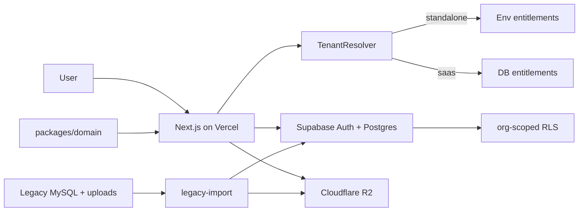

# Architecture notes

Companion to [developer-brief.md](./developer-brief.md). Keep this short and normative.

---

## High-level flow



---

## Tenant resolution

| Mode | How org is chosen | Entitlements |
|------|-------------------|--------------|
| `standalone` | Fixed `DEFAULT_ORGANIZATION_ID` (env) | Env / config overrides |
| `saas` | From membership of signed-in user | Subscription + module rows in Postgres |

Hide org registration/switcher in standalone. Enable SaaS registration only in SaaS mode (`Auth / Register Organization`).

---

## Identity model

```text
auth.users (Supabase)
    └── organization_memberships
            ├── organization_id
            ├── role(s) + scope
            ├── permissions[]
            └── employee_id? → employees
```

- Creating an employee (HR) writes `employees` (+ employment/statutory/profile).
- Activating login links or creates `auth.users` and a membership row.
- Managers are employees with a manager role / reporting edges to their team.

---

## Data rules

1. `organization_id` on every business table.
2. Soft-delete / status flags preferred over hard delete for people and payruns.
3. Locked payroll runs are immutable (items + components).
4. Private files: tenant-prefixed R2 keys; download only via authorized signed URL; store metadata in Postgres.
5. Approval flows go through one reusable state machine (leave, claim, OT, late, manual attendance, replacement credit).

---

## Domain ownership

| Package | Owns |
|---------|------|
| `packages/domain` | Pure rules: leave days, lateness, approval transitions, payroll calc inputs/outputs |
| `packages/platform` | I/O adapters: Supabase client, R2, mail, jobs, tenant |
| `packages/db` | Queries/repositories only — no HTTP |
| `apps/web` | Routes, RSC/server actions, middleware, UI composition |

UI must not contain payroll formulas or leave entitlement math.

---

## Malaysia payroll (Phase 8)

- Authoritative: official KWSP / PERKESO / LHDN / HRD schedules (effective-dated tables in DB).
- Secondary check: Payroll.my outputs as fixtures only.
- Legacy PHP: behaviour reference only.
- Repo reference data: `malaysia-payroll-official-2026.json` (+ supplement).
- Every golden fixture stores calculator version + expected totals.

---

## Security checklist

- [x] RLS denies cross-org reads/writes — dual-org seeded JWT probe in `supabase/tests/001_rls_matrix.sql`; CI job `rls-matrix` runs `supabase test db` (2026-08-27 re-audit).
- [x] Manager cannot approve outside team scope — `apps/web/src/lib/approvals/service.ts` requires `step.approver_employee_id === actorEmployeeId` (approver is the assigned manager).
- [x] HR create-employee is org-scoped and audited — `apps/web/src/lib/employees/create-employee.ts` writes `organization_id` + `logEmployeeEvent`.
- [x] R2 objects not world-readable — private bucket + `getSignedDownloadUrl` / download ACL (`apps/web/src/lib/files/storage.ts`, `/api/files/[fileId]/download`).
- [x] Scheduled job endpoints are authenticated / locked down — each `/api/cron/*` checks `Authorization: Bearer CRON_SECRET`; middleware bypasses session only after that path match.
- [x] Payroll regenerate is atomic; locked runs cannot change — locked payruns reject delete (`workflow.ts`); lock transition via payroll actions; regenerate creates draft runs only (`generate.ts`).

### Entitlements packaging

- Standalone env provider (`createEnvEntitlementProvider`): unset `PRODUCT_TIER` defaults to **enterprise** (all modules). Set `PRODUCT_TIER=core|professional` for narrower packaging; optional `MODULE_OVERRIDES` JSON toggles.
- Owner may edit tier/module flags in standalone; SaaS tier changes are Platform-only.
- Payroll module key is **Pro** in `packages/platform` entitlements even when sold as part of a commercial bundle.

### Specialist permissions

- **Wired:** `payroll_processor`, `payroll_approver`, `auditor` (`WIRED_SPECIALIST_PERMISSIONS` in `packages/domain/src/roles.ts`).
- **Deferred (catalog only):** recruiter, document_custodian, asset_manager, exporter, integration_manager — do not invent path gates until product needs duty segregation.

### Jobs / outbox

- Durable work: `notification_outbox` + Vercel cron routes. In-memory `packages/platform` jobs ledger is **deprecated**.
- `/api/health` reports pending notification/webhook outbox depths under `ops` (informational).
- Platform Admin dashboard (`/platform/dashboard`) surfaces the same health probes for ops.

### Email

- Production checklist: [email-ops-checklist.md](./email-ops-checklist.md)
---

## Environments

Suggested env (names illustrative):

```bash
DEPLOYMENT_MODE=standalone|saas
DEFAULT_ORGANIZATION_ID=...          # standalone
NEXT_PUBLIC_SUPABASE_URL=...
NEXT_PUBLIC_SUPABASE_ANON_KEY=...
SUPABASE_SERVICE_ROLE_KEY=...        # server only
R2_ACCOUNT_ID=...
R2_ACCESS_KEY_ID=...
R2_SECRET_ACCESS_KEY=...
R2_BUCKET=...
MAIL_FROM=...
```

Never expose service role or R2 secrets to the client.
