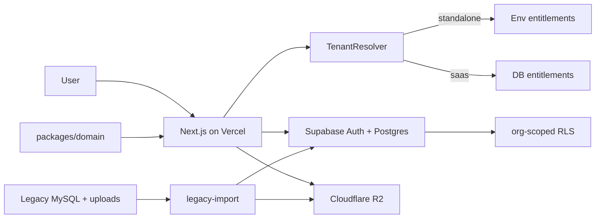

# Architecture notes

Companion to [developer-brief.md](./developer-brief.md). Keep this short and normative.

---

## High-level flow



---

## Tenant resolution

| Mode | How org is chosen | Entitlements |
|------|-------------------|--------------|
| `standalone` | Fixed `DEFAULT_ORGANIZATION_ID` (env) | Env / config overrides |
| `saas` | From membership of signed-in user | Subscription + module rows in Postgres |

Hide org registration/switcher in standalone. Enable SaaS registration only in SaaS mode (`Auth / Register Organization`).

---

## Identity model

```text
auth.users (Supabase)
    └── organization_memberships
            ├── organization_id
            ├── role(s) + scope
            ├── permissions[]
            └── employee_id? → employees
```

- Creating an employee (HR) writes `employees` (+ employment/statutory/profile).
- Activating login links or creates `auth.users` and a membership row.
- Managers are employees with a manager role / reporting edges to their team.

---

## Data rules

1. `organization_id` on every business table.
2. Soft-delete / status flags preferred over hard delete for people and payruns.
3. Locked payroll runs are immutable (items + components).
4. Private files: tenant-prefixed R2 keys; download only via authorized signed URL; store metadata in Postgres.
5. Approval flows go through one reusable state machine (leave, claim, OT, late, manual attendance, replacement credit).

---

## Domain ownership

| Package | Owns |
|---------|------|
| `packages/domain` | Pure rules: leave days, lateness, approval transitions, payroll calc inputs/outputs |
| `packages/platform` | I/O adapters: Supabase client, R2, mail, jobs, tenant |
| `packages/db` | Queries/repositories only — no HTTP |
| `apps/web` | Routes, RSC/server actions, middleware, UI composition |

UI must not contain payroll formulas or leave entitlement math.

---

## Malaysia payroll (Phase 8)

- Authoritative: official KWSP / PERKESO / LHDN / HRD schedules (effective-dated tables in DB).
- Secondary check: Payroll.my outputs as fixtures only.
- Legacy PHP: behaviour reference only.
- Repo reference data: `malaysia-payroll-official-2026.json` (+ supplement).
- Every golden fixture stores calculator version + expected totals.

---

## Security checklist

- [ ] RLS denies cross-org reads/writes
- [ ] Manager cannot approve outside team scope
- [ ] HR create-employee is org-scoped and audited
- [ ] R2 objects not world-readable
- [ ] Scheduled job endpoints are authenticated / locked down
- [ ] Payroll regenerate is atomic; locked runs cannot change

---

## Environments

Suggested env (names illustrative):

```bash
DEPLOYMENT_MODE=standalone|saas
DEFAULT_ORGANIZATION_ID=...          # standalone
NEXT_PUBLIC_SUPABASE_URL=...
NEXT_PUBLIC_SUPABASE_ANON_KEY=...
SUPABASE_SERVICE_ROLE_KEY=...        # server only
R2_ACCOUNT_ID=...
R2_ACCESS_KEY_ID=...
R2_SECRET_ACCESS_KEY=...
R2_BUCKET=...
MAIL_FROM=...
```

Never expose service role or R2 secrets to the client.
