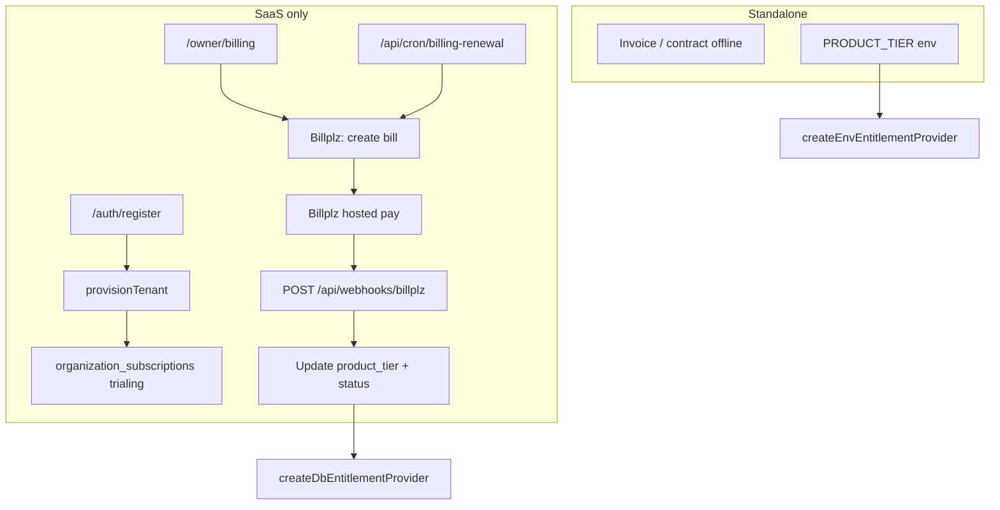

# SaaS billing design — Billplz subscription plans

**Date:** 2026-08-27  
**Status:** Pricing **approved** (2026-08-27); implementation plan ready  
**Scope:** SaaS mode only (`DEPLOYMENT_MODE=saas`). Standalone stays offline/sales-led (no Billplz).  
**Depends on:** Dual-mode isolation complete ([dual-mode plan](../plans/2026-08-27-dual-mode-saas-standalone-plan.md), packages #1–6 + Phase 2).  
**Provider:** [Billplz API v4](https://www.billplz.com/api) (MYR, FPX/cards/e-wallets)

---

## Goal

Enable **self-serve SaaS plan subscriptions** (Core / Professional / Enterprise) paid in **MYR via Billplz**, while reusing existing `organizations.product_tier` + `module_flags` entitlements. Standalone customers continue to pay outside the app.

**Success criteria (v1):**

1. New SaaS tenant can pick a plan and pay via Billplz FPX/card.
2. Successful payment activates the matching `product_tier` and modules.
3. Monthly renewal generates a new Billplz bill; unpaid past grace → restricted access.
4. Owner can view billing status, pay open invoice, upgrade tier.
5. Platform admin can override tier (existing) and see subscription health.
6. Webhooks are verified (X Signature) and idempotent.

---

## Billplz constraints (design drivers)

| Fact | Implication for HRMS |
| --- | --- |
| **No native subscription engine** | HRMS owns subscription lifecycle; Billplz only collects per-bill |
| **MYR only, amounts in cents** | Plans priced in RM; store integer sen in DB |
| **Bills belong to Collections** | One Billplz Collection per product tier (or one collection + metadata) |
| **Callback + redirect are independent** | Must handle duplicate delivery; idempotency keys on `billplz_bill_id` |
| **X Signature on callback/redirect** | Verify all server callbacks before mutating entitlements |
| **Bills expire (~30 days default)** | Renewal cron must create bills before/on due date |

Billplz is a **payment rail**, not a billing platform. We implement subscriptions in Postgres + cron, similar to how report-subscriptions already work in this codebase.

---

## Approach options

### A — Pay-first, then provision (strict signup→pay)

Register collects org details → create Billplz bill → redirect to Billplz → on `paid` callback → `provisionTenant` + sign-in.

| Pros | Cons |
| --- | --- |
| No unpaid tenants in DB | Loses partial signup if user abandons payment |
| Cleanest money path | Harder recovery / sales follow-up |
| | More complex session handoff before org exists |

### B — Register + trial/grace, then pay (recommended)

Keep current register → provision → sign-in. Set `subscription_status = trialing` (e.g. 14 days). Before trial ends, owner must pay via Billplz or app enters `past_due` / read-only.

| Pros | Cons |
| --- | --- |
| Matches current SaaS onboarding | Some unpaid orgs exist briefly |
| Owner can evaluate product | Need grace/dunning policy |
| Platform can still manual-provision | |

### C — Platform-only billing (status quo + manual)

Platform admin sets tier; Billplz used only for manual invoice links sent by ops.

| Pros | Cons |
| --- | --- |
| Minimal build | Not self-serve SaaS |

**Recommendation:** **Option B** for v1 GA, with **Option A** as a config flag (`BILLING_SIGNUP_MODE=pay_first|trial_first`) for a later sales-led funnel.

---

## Architecture



**Package placement (follow existing boundaries):**

| Layer | Owns |
| --- | --- |
| `packages/platform/src/billing/billplz/` | HTTP client, signature verify, DTO mappers |
| `apps/web/src/lib/billing/` | Subscription service, entitlement sync, dunning rules |
| `apps/web/src/app/api/webhooks/billplz/` | Webhook route |
| `apps/web/src/app/api/cron/billing-renewal/` | Renewal + dunning cron |
| `supabase/migrations/` | Subscription tables + RLS |

---

## Product plans & pricing — **APPROVED** (2026-08-27)

**Commercial decisions locked:**

| Decision | Choice |
| --- | --- |
| Model | **Option A** — base package + overage |
| Included staff | **10** in base (all tiers) |
| Trial | **14-day trial only** (Professional features) — no free ≤3 staff tier |
| Billing interval | **Monthly or annual** (customer chooses) |
| Annual discount | **2 months free** — pay 10× monthly base for 12 months |
| SST | **+8%** shown at checkout; included in Billplz amount |
| Standalone | No Billplz (unchanged) |

Reuse `ProductTier`: `core` | `professional` | `enterprise`.

> Prices below are **before SST**. Billplz bill = subtotal + 8% SST.

### Locked price table (Option A)

| Tier | Included staff | Base / month | Overage / extra staff | Base / year (10 mo) |
| --- | --- | --- | --- | --- |
| **Core** | 10 | **RM 69** | **RM 6** | **RM 690** |
| **Professional** | 10 | **RM 129** | **RM 12** | **RM 1,290** |
| **Enterprise** | 10 | **RM 179** | **RM 17** | **RM 1,790** |

**Monthly total formula:**

```
subtotal = base_monthly(tier) + max(0, active_employees - 10) × overage_rate(tier)
billplz_amount = round(subtotal × 1.08)   // SST
```

**Annual total formula (base only, at signup/renewal):**

```
annual_subtotal = base_yearly(tier)   // 10 × monthly base
annual_billplz = round(annual_subtotal × 1.08)
```

**Overage on annual plans:** Base is prepaid for 12 months. **Extra staff beyond 10 billed monthly** (separate Billplz bill each month for overage × 1.08). Employee count snapshot on billing cron day.

**Example monthly totals (before SST):**

| Staff | Core | Professional | Enterprise |
| --- | --- | --- | --- |
| 5 | RM 69 | RM 129 | RM 179 |
| 10 | RM 69 | RM 129 | RM 179 |
| 20 | RM 129 | RM 249 | RM 349 |
| 50 | RM 309 | RM 609 | RM 859 |

**Register / billing UI copy:** show monthly price and annual equivalent, e.g. “RM 129/mo or RM 1,290/yr (2 months free)”.

---

### Malaysian market benchmark (reference)

Competitors use **per-employee (PEPM)**, **modular add-ons**, or **headcount packages** — rarely one flat fee for all sizes.

| Competitor | Model | ~5 staff | ~10 staff | ~20 staff | Notes |
| --- | --- | --- | --- | --- | --- |
| **Swingvy** | RM 8.50/module/user; HR+Payroll ≈ RM 17/user | RM 85/mo | RM 170/mo | **RM 340/mo** | Min 5 users billed |
| **altHR Lite** | Package (not true PEPM) | ~RM 80/mo (10-user pkg) | RM 80/mo | ~RM 160/mo est. | 12-mo contract common |
| **altHR Pro** | Package | ~RM 200/mo (10-user pkg) | RM 200/mo | ~RM 400/mo est. | 22 modules |
| **Kakitangan** | Modular brackets | RM 50+ (payroll only) | ~RM 230/mo all modules | ~RM 350–450/mo | **Free ≤3 staff** |
| **BrioHR** | PEPM, min RM 200 | RM 200/mo | RM 200/mo | RM 200/mo | RM ~10/emp above min |
| **HReasily** | From RM 8/emp | ~RM 40+ | ~RM 80+ | ~RM 160+ | |
| **PayrollPanda** | Free payroll | RM 0 | RM 0 | RM 0 | Payroll-only; no full HRMS |

**Our tier mapping (what we’re selling):**

| HRMS tier | Comparable to | Must win on |
| --- | --- | --- |
| **Core** | altHR Lite light / basic HR | Leave, docs, calendar — **no payroll** |
| **Professional** | Swingvy HR+Payroll, Kakitangan full | **Malaysia payroll + HR** in one app |
| **Enterprise** | altHR Pro + integrations | API, audit, recruitment, analytics |

---

## Data model (technical)

### `billing_plans` (catalog)

| Column | Notes |
| --- | --- |
| `id` | uuid |
| `tier` | `core` \| `professional` \| `enterprise` unique |
| `name` | Display name |
| `base_amount_sen_monthly` | e.g. 12900 for Professional |
| `base_amount_sen_yearly` | e.g. 129000 (10 × monthly) |
| `overage_amount_sen` | per extra active employee / month |
| `included_headcount` | default 10 |
| `billplz_collection_id` | Billplz Collection ID for this tier |
| `trial_days` | default 14 |
| `is_active` | bool |

### `organization_subscriptions`

One row per org (SaaS only).

| Column | Notes |
| --- | --- |
| `organization_id` | FK → organizations, unique |
| `plan_id` | FK → billing_plans |
| `billing_interval` | `month` \| `year` |
| `status` | `trialing` \| `active` \| `past_due` \| `canceled` \| `paused` |
| `current_period_start` | timestamptz |
| `current_period_end` | timestamptz |
| `trial_ends_at` | nullable |
| `cancel_at_period_end` | bool default false |
| `billplz_email` | payer email (owner) |

### `subscription_invoices` (internal invoice ledger)

| Column | Notes |
| --- | --- |
| `id` | uuid |
| `organization_id` | |
| `subscription_id` | |
| `plan_id` | snapshot at invoice time |
| `amount_sen` | subtotal before SST |
| `sst_sen` | 8% of subtotal |
| `total_sen` | amount + SST (Billplz charge) |
| `invoice_type` | `subscription` \| `overage` |
| `period_start` / `period_end` | |
| `status` | `draft` \| `open` \| `paid` \| `void` \| `uncollectible` |
| `due_at` | |

### `billplz_bills` (payment attempts)

| Column | Notes |
| --- | --- |
| `id` | uuid |
| `invoice_id` | FK |
| `billplz_bill_id` | unique — idempotency anchor |
| `billplz_url` | hosted payment URL |
| `state` | `due` \| `paid` \| `deleted` (mirror Billplz) |
| `paid_at` | nullable |
| `callback_payload` | jsonb last webhook body |

### `billing_events` (audit)

Append-only: `organization_id`, `event_type`, `payload`, `occurred_at`. Mirrors pattern of `audit_events`.

**RLS:** Org members with `organization_owner` read own subscription/invoices; writes via service role / server actions only. Platform admin read-all.

---

## Key flows

### 1. Register (trial-first — default)

1. User submits register form (add **plan picker**).
2. `provisionTenant` creates org on selected tier (or Core default).
3. Insert `organization_subscriptions` with `status=trialing`, `trial_ends_at=now+14d`.
4. Sign in + set active org cookie → `/owner/dashboard`.
5. Banner: “Trial ends {date}. Add payment method.” → `/owner/billing`.

### 2. First payment / upgrade

1. Owner opens `/owner/billing` → selects plan (if upgrading).
2. Server creates `subscription_invoice` (`open`).
3. Call Billplz **Create Bill** (v4):
   - `collection_id` from `billing_plans.billplz_collection_id`
   - `amount` in sen
   - `email` = owner email
   - `name` / `description` = e.g. `HRMS Professional — Aug 2026`
   - `callback_url` = `https://{app}/api/webhooks/billplz`
   - `redirect_url` = `https://{app}/owner/billing?paid=1`
   - `reference_1` = `invoice_id` (our uuid)
4. Store `billplz_bills` row; redirect user to `billplz_url`.

### 3. Webhook (callback)

`POST /api/webhooks/billplz`

1. Verify **X Signature** (Billplz docs: HMAC over sorted key-value pairs).
2. Parse bill id + `paid` + `reference_1`.
3. Idempotent upsert: if already `paid`, return 200.
4. On `paid=true`:
   - Mark invoice + billplz_bill paid
   - Set subscription `status=active`
   - Update `organizations.product_tier` from invoice plan
   - Reset `current_period_start/end` (+1 month)
   - Log `billing_events`
5. Return 200 quickly (no heavy work inline — optional outbox if needed).

**Duplicate callback + redirect:** Both may fire; use `billplz_bill_id` unique constraint.

### 4. Monthly renewal (cron)

`GET /api/cron/billing-renewal` (CRON_SECRET, daily 09:00 MYT)

For each subscription where `status in (active, past_due)` and `current_period_end <= today + 3 days`:

1. Create `subscription_invoice` for next period.
2. Create Billplz bill; email owner (existing notification outbox) with pay link.
3. If `current_period_end` passed and invoice still open → `past_due`.

### 5. Dunning / access control

| Status | App behavior |
| --- | --- |
| `trialing` | Full access until `trial_ends_at` |
| `active` | Full access |
| `past_due` | **Grace 7 days:** banner + block new writes (payroll lock, no new employees). HR read-only. |
| `canceled` | Login allowed; portal shows “Subscription ended”; export-only window 30 days (policy TBD) |

Enforcement: middleware or `requireActiveSubscription()` in server actions for mutating HR/payroll routes. Read dashboards stay available during short past_due.

### 6. Upgrade / downgrade

- **Upgrade:** immediate new invoice (prorata optional v2); on pay → tier bump.
- **Downgrade:** `cancel_at_period_end` or schedule at `current_period_end` (v1: at period end only).

### 7. Platform admin

- Keep existing tier dropdown on `/platform/tenants` for support overrides.
- Add subscription status column + “Mark comp / extend trial” actions (writes `billing_events` + audit).

**Standalone:** none of the above runs; `isSaasMode()` gates all billing code paths.

---

## Billplz setup (ops)

1. Billplz account (Basic or Standard plan).
2. Create **3 Collections** (Core / Pro / Enterprise) in Billplz dashboard.
3. API keys in env (see below).
4. Enable **X Signature Callback URL** in Billplz settings.
5. Sandbox: use Billplz sandbox API base if available; else small-amount test bills in production.

---

## Environment variables

| Variable | Mode | Purpose |
| --- | --- | --- |
| `BILLPLZ_API_KEY` | SaaS | Secret key (server only) |
| `BILLPLZ_X_SIGNATURE_KEY` | SaaS | Webhook/redirect verification |
| `BILLPLZ_COLLECTION_CORE` | SaaS | Collection ID |
| `BILLPLZ_COLLECTION_PROFESSIONAL` | SaaS | Collection ID |
| `BILLPLZ_COLLECTION_ENTERPRISE` | SaaS | Collection ID |
| `BILLPLZ_API_BASE` | SaaS | Default `https://www.billplz.com/api` |
| `BILLING_TRIAL_DAYS` | SaaS | Default `14` |
| `BILLING_SIGNUP_MODE` | SaaS | `trial_first` (default) or `pay_first` (v2) |
| `BILLING_PAST_DUE_GRACE_DAYS` | SaaS | Default `7` |

Not required in standalone. Health check: Billplz vars required only when `DEPLOYMENT_MODE=saas` **and** `BILLING_ENABLED=true`.

---

## UI surfaces (v1)

| Route | Who | Purpose |
| --- | --- | --- |
| `/auth/register` | Public | Plan picker (3 tiers) |
| `/owner/billing` | Org owner | Current plan, trial/paid status, pay button, invoice history |
| `/owner/settings` | Org owner | Link to billing; hide tier self-change in SaaS (already blocked) |
| `/platform/tenants` | Platform admin | Tier + subscription status; comp/extend |

No public marketing/pricing page in v1 (still FUTURE #18). Register page carries minimal plan comparison.

---

## Security

- Never expose `BILLPLZ_API_KEY` to client.
- Verify X Signature on every callback; reject unsigned in production.
- Rate-limit bill creation (`checkRateLimitDurable` per org).
- Webhook route: no session auth; CRON_SECRET pattern for cron.
- RLS: tenants cannot read other orgs’ invoices.
- Log all tier changes in `billing_events` + `audit_events`.

---

## Testing strategy

| Layer | Tests |
| --- | --- |
| Unit | Signature verification, plan price calc, status transitions |
| Integration | Mock Billplz HTTP; webhook idempotency; entitlement sync |
| E2e (optional) | Register → billing page → mock paid webhook → tier active |

CI: `saas-billing-unit` job with `DEPLOYMENT_MODE=saas`, no live Billplz calls.

---

## Implementation phases

### Phase B1 — Foundation (M)

- Migration: tables above + seed `billing_plans`
- `packages/platform/billplz` client + signature helper
- Webhook route + idempotent handler
- Sync `product_tier` on paid

### Phase B2 — Owner UX (M)

- `/owner/billing` page
- Create bill + redirect
- Register plan picker
- Trial banner in portal shell

### Phase B3 — Renewal & dunning (M)

- Renewal cron
- Email via notification outbox (“Your HRMS invoice is ready”)
- `past_due` enforcement helper

### Phase B4 — Platform ops (S)

- Tenant subscription column
- Comp / extend trial actions
- Docs + runbook update

**Defer v2:** pay-first signup, prorata upgrades, FPX auto-debit, seat hard limits, formal SST tax invoices.

---

## Standalone vs SaaS (billing)

| | Standalone | SaaS |
| --- | --- | --- |
| Payment | Offline invoice / contract | Billplz subscription bills |
| Tier source | `PRODUCT_TIER` env + owner settings | `organization_subscriptions` → DB tier |
| Register | Disabled | Plan + trial |
| Billplz | Not used | Required for self-serve GA |

---

## Commercial decisions — locked ✅

| # | Decision | Approved |
| --- | --- | --- |
| 1 | Pricing model | Option A (base + overage) |
| 2 | Professional @ 20 staff | RM 249/mo OK |
| 3 | Micro hook | Trial only (14 days) |
| 4 | Billing interval | Monthly **or** annual (2 months free) |
| 5 | Included headcount | 10 (all tiers) |
| 6 | SST | +8% on Billplz bill |
| 7 | Trial length | 14 days |
| 8 | Past-due grace | 7 days partial lock |
| 9 | Pay-first signup | Defer v2 |
| 10 | Platform comp override | Yes |

**Next:** [Implementation plan](../plans/2026-08-27-billplz-saas-billing.md)

---

## References

- Billplz API v4: https://www.billplz.com/api  
- Existing entitlements: `packages/platform/src/entitlements/`  
- SaaS ops: `docs/saas-ops-notes.md`  
- Gap analysis package #10: billing FUTURE → this spec

---

## Approval

Pricing and commercial terms approved 2026-08-27. Implementation: [2026-08-27-billplz-saas-billing.md](../plans/2026-08-27-billplz-saas-billing.md) (Phases B1–B4).
